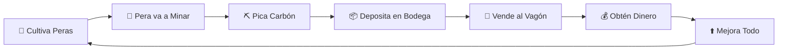

<p align="center">
  
</p>

<h1 align="center">🍐 PERA TYCOON</h1>

<p align="center">
  <b>Un juego de Roblox donde las peras trabajan para ti.</b><br/>
  <i>Minería. Estrategia. Peras.</i>
</p>

<p align="center">
  
  
  
  
</p>

---

## 🎮 ¿De qué trata?

**Pera Tycoon** es un juego estilo *idle tycoon* donde gestionas un equipo de simpáticas **peras mineras** que extraen carbón de una mina central.

Tu objetivo: **optimizar la producción**, mejorar tus peras y sus herramientas, y vender el carbón para convertirte en el magnate de las peras más exitoso del servidor.

---

## ✨ Características Principales

| Característica | Descripción |
|----------------|-------------|
| 🍐 **Gestión de Peras** | Controla hasta 15 peras trabajadoras con estadísticas únicas |
| ⛏️ **Minería Automática** | Tus peras van a la mina, recolectan carbón y lo traen a tu bodega |
| 🌳 **Árbol de Peras** | Cultiva nuevas peras en tu árbol con 3 slots de cultivo |
| 📦 **Sistema de Bodega** | Almacena carbón y obtén +15% bonus al vender con bodega llena |
| 🚃 **Vagón de Venta** | Espera el vagón circular para vender tu producción |
| 🎁 **Huevos / Loot** | Obtén accesorios únicos para personalizar tus peras |
| ⚒️ **Mejoras** | Mejora velocidad, capacidad, picos y más |

---

## 🗺️ El Mapa

```
         🍕 Parcela 1      🍕 Parcela 2
              ╲              ╱
               ╲    ⛰️     ╱
                ╲  MINA  ╱
         P12 ────( CORE )──── P3
                ╱        ╲
               ╱          ╲
         🍕 P11    ...    🍕 P4
         
    🚃 ═══ Vía del Vagón (circular) ═══ 🚃
```

- **12 parcelas** iguales en forma de torta
- **Mina central** con túneles y vetas de carbón
- **Vagón de venta** que circula por todas las parcelas

---

## 🍐 Ciclo de Juego



---

## 📁 Estructura del Proyecto

```
PeraTycon/
├── documentacion/
│   ├── DocumentacionInicial.md   # Diseño completo del juego
│   ├── Mapas_Tecnicos.md         # Diagramas y layouts
│   └── MVP.md                    # Plan de desarrollo mínimo
├── src/                          # Scripts de Roblox (próximamente)
└── README.md                     # Este archivo
```

---

## 🛠️ Estado del Desarrollo

- [x] Documentación de diseño
- [x] Mapas técnicos
- [ ] Prototipo del mapa en Roblox Studio
- [ ] Sistema de peras (IA/Pathfinding)
- [ ] Sistema de minería
- [ ] Sistema de bodega y venta
- [ ] Sistema de árbol y cultivo
- [ ] UI/UX
- [ ] Sistema de mejoras
- [ ] Sistema de huevos/loot

---

## 👨‍💻 Desarrollo

Este proyecto está siendo desarrollado usando:
- **Roblox Studio** - Motor del juego
- **Luau** - Lenguaje de scripting
- **Rojo** - Sincronización de código (opcional)

---

## 📜 Licencia

Este proyecto es privado y está en desarrollo activo.

---

<p align="center">
  <b>Hecho con 🍐 y ☕ por el equipo de PeraTycon</b>
</p>
