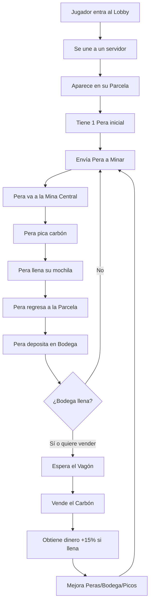

# 🍐 PERA TYCOON - Documentación del Juego

## 📋 Resumen General

**Nombre del Juego:** Pera Tycoon (Minería de Pera)  
**Género:** Tycoon / Idle Mining Simulator  
**Jugadores por Servidor:** 10-12 jugadores  
**Plataforma:** Roblox

### Concepto
Juego estilo tycoon donde el jugador gestiona peras mineras que recolectan carbón de una mina central. El objetivo es optimizar la producción, mejorar las peras y sus herramientas, y vender el carbón para obtener ganancias.

---

## 🗺️ Estructura del Mapa

> 📄 **Ver mapas detallados:** [Mapas_Tecnicos.md](Mapas_Tecnicos.md)

### Lobby Principal
- Zona de spawn clásica de Roblox
- Sistema de matchmaking para unirse a servidores
- Tienda de skins y mejoras permanentes
- Visualización de estadísticas del jugador

### Mapa de Juego
- **Forma:** Circular, dividido como gráfico de tortas
- **Divisiones:** 10-12 parcelas iguales (una por jugador)
- **Centro:** Cerro/Montaña con la mina principal
- **Elemento móvil:** Vagón de venta que circula por todas las parcelas

### Parcela del Jugador (Cada porción del mapa)
Cada parcela contiene:
- 🌳 **Árbol de Peras** (generador de nuevas peras)
- 📦 **Bodega de Almacenamiento** (guarda el carbón recolectado)
- 🛤️ **Zona de descarga** (donde las peras dejan el carbón)
- 🚃 **Punto de paso del vagón** (para vender carbón)

### La Mina Central
- Ubicada en el centro del mapa (cerro/montaña)
- Sistema de túneles
- **Core:** Zona con carbón y vetas de carbón
- Accesible para todas las peras de todos los jugadores

---

## 🍐 Sistema de Peras

### Información General
| Atributo | Valor |
|----------|-------|
| Peras iniciales | 1 |
| Máximo de peras | 15 por jugador |
| Método de obtención | Árbol de Peras (cultivo) |

### Estadísticas de Cada Pera
| Estadística | Descripción | Mejorable |
|-------------|-------------|-----------|
| **Velocidad de Picoteo** | Qué tan rápido pica el carbón | ✅ Sí |
| **Capacidad de Carga** | Cantidad de carbón en la mochila | ✅ Sí |
| **Velocidad de Movimiento** | Rapidez al desplazarse | ✅ Sí |
| **Eficiencia de Recolección** | Cantidad de carbón obtenido por golpe | ✅ Sí |

### Equipamiento: Picos
Cada pera tiene un pico equipado que otorga:
- **Buff de velocidad** de minado
- **Buff de eficiencia** de recolección
- Los picos son mejorables

### Ciclo de Trabajo de una Pera
```
1. 🚶 Sale de la parcela hacia la mina central
2. ⛏️ Entra a los túneles y pica carbón
3. 🎒 Llena su mochila (capacidad limitada)
4. 🚶 Regresa a la parcela
5. 📦 Deposita el carbón en la bodega
6. 🔄 Repite el ciclo
```

---

## 🌳 Sistema del Árbol de Peras

### Estructura
- **Slots de cultivo:** 3 cultivadoras por árbol
- **Semillas:** Se plantan semillas de pera en los slots

### Fases de Crecimiento (Visual)
| Fase | Descripción | Interacción |
|------|-------------|-------------|
| 🌱 **Germinación** | La semilla comienza a brotar | Solo visual |
| 🌸 **Floración** | La pera se está formando | Solo visual |
| 🍐 **Cosecha** | La pera está madura e inflada | Usuario puede cosechar |

### Mecánica de Cosecha
- La pera madura **cae al piso automáticamente** cuando está lista
- Al caer, la pera se **activa y comienza a trabajar**
- El usuario solo puede interactuar cuando la pera está **madura**

---

## 📦 Sistema de Bodega

### Características
| Atributo | Descripción |
|----------|-------------|
| Función | Almacenar carbón recolectado por las peras |
| Capacidad | Limitada (mejorable) |
| Mejoras | Se puede aumentar la capacidad |

### Bonificación por Bodega Llena
- Si la bodega está **100% llena** al momento de vender: **+15% bonus** en la venta

---

## 🚃 Sistema de Venta (Vagón)

### Mecánica del Vagón
- El vagón se desplaza **en círculo** por todo el mapa
- Pasa por **todas las parcelas** de los jugadores
- **Solo se puede vender** cuando el vagón está en tu parcela

### Estrategia de Venta
| Condición | Bonus |
|-----------|-------|
| Venta normal (bodega no llena) | 0% |
| Venta con bodega llena | +15% |

---

## 🎁 Sistema de Huevos / Loot Boxes

### Drop de Cajas
- Los huevos son **cajas de loot** que dropean durante el juego
- Contienen recompensas aleatorias

### Contenido de los Huevos
| Tipo | Ejemplos |
|------|----------|
| **Accesorios para Peras** | Lentes, cascos mineros, sombreros |
| **Cosméticos** | (Por definir) |
| **Otros** | (Por definir) |

> ⚠️ **PENDIENTE:** Definir lista completa de accesorios y sus efectos/raridades

---

## 📊 Sistema de Mejoras

### Mejoras de Peras
- Velocidad de picoteo
- Capacidad de carga (mochila)
- Velocidad de movimiento
- Eficiencia de recolección

### Mejoras de Picos
- Velocidad de minado
- Eficiencia de recolección

### Mejoras de Infraestructura
- Capacidad de la bodega
- (Más por definir)

---

## 🎯 Flujo de Juego Resumido



---

## 📝 Notas y Pendientes

### Por Definir
- [ ] Lista completa de accesorios de huevos
- [ ] Raridades de items en huevos
- [ ] Precios de mejoras
- [ ] Tipos de semillas de pera
- [ ] Sistema de moneda (nombre, icono)
- [ ] Skins disponibles en el lobby
- [ ] Tiempos de crecimiento del árbol
- [ ] Velocidad del vagón
- [ ] Cantidad de carbón en las vetas

### Ideas Futuras (Opcional)
- [ ] Eventos especiales
- [ ] Diferentes tipos de minerales
- [ ] Peras especiales/legendarias
- [ ] Sistema de clanes/gremios
- [ ] Logros y badges
- [ ] Pase de temporada

---

## 🔧 Arquitectura Técnica (Scripts)

> Esta sección se completará cuando empecemos a programar

### Scripts del Servidor (ServerScriptService)
- `GameManager` - Control general del juego
- `MiningSystem` - Lógica de minería
- `PearController` - Control de comportamiento de peras
- `StorageSystem` - Sistema de bodega
- `WagonSystem` - Sistema del vagón de venta
- `TreeSystem` - Sistema del árbol de peras
- `LootSystem` - Sistema de huevos/drops

### Scripts del Cliente (StarterPlayerScripts)
- `UIController` - Interfaz de usuario
- `CameraController` - Control de cámara
- `InputHandler` - Manejo de inputs

### Módulos Compartidos (ReplicatedStorage)
- `Config` - Configuraciones del juego
- `PearData` - Datos de las peras
- `UpgradeData` - Datos de mejoras

---

*Última actualización: 22 de Diciembre 2024*  
*Estado: En desarrollo inicial*
