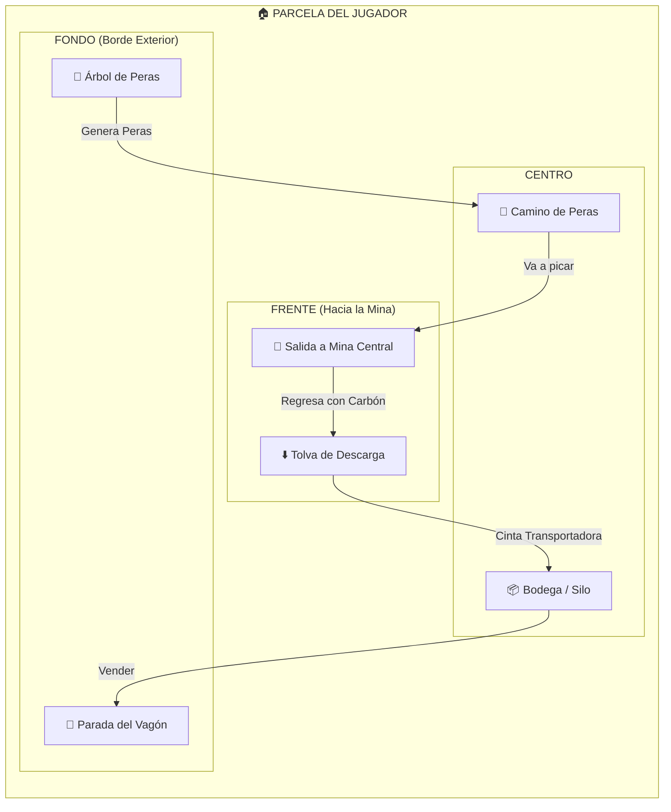

# 🗺️ Mapas Técnicos - Pera Tycoon

Debido a limitaciones técnicas actuales para generar imágenes, aquí se presentan los diagramas técnicos detallados en formato lógico y esquemático.

## 1. Mapa Completo del Servidor (Vista Técnica)

### Concepto
Un diseño circular tipo "tarta" (pie chart) optimizado para 10-12 jugadores.

```mermaid
graph TB
    subgraph GLOBAL_MAP["🌎 MAPA GLOBAL"]
        direction TB
        
        subgraph CENTER["⛰️ MONTAÑA CENTRAL (Mina)"]
            CORE((🔴 CORE))
            TUNNELS[🕳️ Sistema de Túneles]
        end
        
        subgraph RAIL["🛤️ VÍA FÉRREA EXTERIOR"]
             WAGON[🚃 Vagón de Venta (Móvil)]
        end
        
        subgraph PLOTS["🏘️ PARCELAS DE JUGADORES"]
            P1[🍕 Parcela J1]
            P2[🍕 Parcela J2]
            P3[🍕 Parcela J3]
            P6[🍕 ... Parcela J12]
        end
        
        GLOBAL_MAP --- CENTER
        PLOTS --- CENTER
        RAIL --- PLOTS
    end
    
    WAGON -->|Circula| P1
    WAGON -->|Circula| P2
    WAGON -->|Circula| P3
```

### Diagrama de Distribución (ASCII)

```
                        NORTE (N)
                           │
                 P12       │       P1
              ╱‾‾‾‾‾‾‾‾‾╲  │  ╱‾‾‾‾‾‾‾‾‾╲
            ╱            ╲ │ ╱            ╲
          ╱               ╲│╱               ╲
      P11│                 ╳                 │ P2
         │      MINA      ╱│╲      MINA      │
         │     (Cerro)   ╱ │ ╲    (Cerro)    │
         │              ╱  │  ╲              │
       ──┼─────────────(  CORE )─────────────┼── ESTE (E)
         │              ╲  │  ╱              │
         │               ╲ │ ╱               │
      P10│                ╲│╱                │ P3
          ╲                ╳                ╱
           ╲              ╱│╲              ╱
            ╲            ╱ │ ╲            ╱
              ╲________╱   │  ╲________╱
                  P9       │       P4
                           │
                         SUR (S)

    🔴 CÍRCULO EXTERIOR = Vía del Vagón de Venta
```

---

## 2. Mapa Detallado de la Parcela (Layout)

### Diseño de la Parcela (Porción)
Cada jugador tiene una sección triangular/cónica.



### Plano en ASCII (Vista Superior)

```
        (HACIA EL CENTRO / MINA)
               ▲
               │
             ╱   ╲      <-- Límite invisible
           ╱       ╲
         ╱   SALIDA  ╲
       ╱      ⬇️       ╲
     ╱                  ╲
   ╱    [ ZONA PASO ]     ╲  ➡️ Camino de las Peras
 ╱                          ╲
│   ┌───────────────┐        │
│   │   ⬇️ TOLVA    │        │
│   └──────┬────────┘        │
│          │ (cinta)         │
│          ▼                 │
│   ┌─────────────┐          │
│   │  📦 BODEGA  │          │
│   └─────────────┘          │
│                            │
│ 🌳 ÁRBOL       [ PANEL ]   │
│ (3 slots)      [ UPGRD ]   │
└────────────────────────────┘
══════════════════════════════
 🛤️  VÍA DEL VAGÓN (RAIL)  🛤️
══════════════════════════════
```

### Leyenda de Elementos

| Icono | Elemento | Función | Notas |
|-------|----------|---------|-------|
| 🌳 | **Árbol** | Spawn de Peras | Tiene 3 slots visuales para peras creciendo. |
| 📦 | **Bodega** | Almacén | Debe mostrar visualmente qué tan llena está. |
| ⬇️ | **Tolva** | Punto de Entrega | Las peras dejan caer el carbón aquí. |
| 🛤️ | **Vía** | Rail System | Por donde pasa el vagón NPC de compra. |
| 🛑 | **Parada** | Zona de Interacción | Donde el jugador se para para vender cuando pasa el vagón. |
